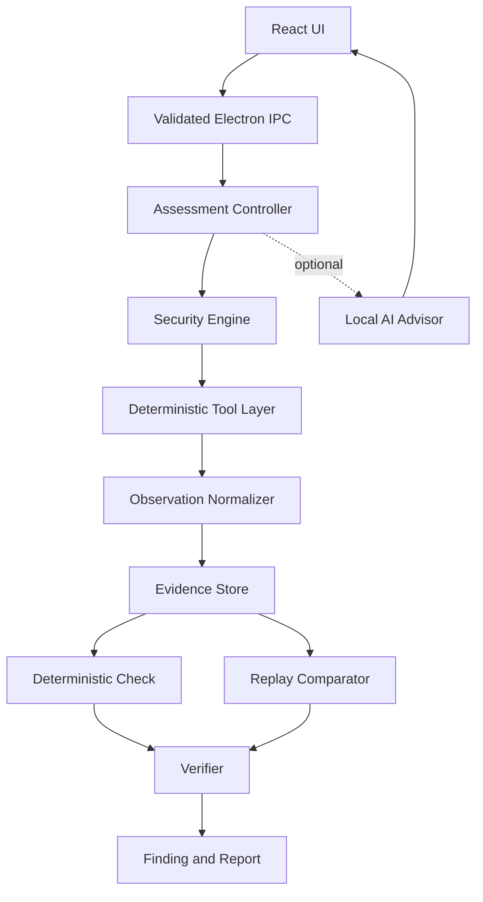

# Sentinel Architecture

## Architectural Position

Sentinel uses a local modular architecture built around Electron, React, a composable security engine, deterministic browser observations, an evidence store, and explicit verification. The MVP has one desktop process boundary and does not require a FastAPI server or distributed infrastructure. Playwright may be used as a deterministic automation and fixture-testing adapter where it improves observation reliability; it does not replace the visible Electron browser without a measured product reason.

## Component Boundaries

### React UI

Responsibility: present scope, workflow progress, evidence, findings, replay status, and reports.

Inputs: validated view models and workflow events.

Outputs: user commands sent through IPC.

Boundary: no security-critical decision or direct browser privilege.

### Validated IPC

Responsibility: expose narrow renderer commands and validate all inputs in the main process.

Inputs: session, navigation, recording, check, replay, and export commands.

Outputs: typed results and observable errors.

Boundary: renderer is untrusted for authorization, scope, and finding status.

### Assessment Controller

Responsibility: own lifecycle, transitions, cancellation, timeout, and coordination.

Inputs: validated commands and normalized observations.

Outputs: workflow events, check requests, verification requests, and user-facing status.

Boundary: may not accept model output as proof of authorization or a confirmed finding.

### Security Engine

Responsibility: validate TestIntent, compose bounded tests from reusable primitives, schedule permitted actions, and connect strategies to verifiers.

Inputs: validated TestIntent, target inventory, application state, scope policy, and evidence references.

Outputs: test instances, permitted tool commands, expected observations, assertions, and workflow events.

Boundary: cannot execute an unvalidated intent, expand scope, or mark a finding confirmed. In the MVP this remains an in-process module, not a generic agent framework.

### Test Model

Responsibility: represent reusable Target, Context, State, Action, Observation, Mutation, Assertion, and Evidence primitives.

Inputs: discovered application facts and workflow definitions.

Outputs: serializable TestIntent and concrete test instance.

Boundary: mutations require explicit policy and user approval where they can change application state.

### Deterministic Tool Layer

Responsibility: control the visible Electron browser or an isolated Playwright fixture context, execute bounded HTTP/browser actions, and enforce supported navigation and permission policy.

Inputs: in-scope navigation and recording commands.

Outputs: normalized browser observations.

Boundary: exact scope policy, redirects, popups, downloads, cross-origin resources, service workers, and unsupported behavior must be explicit.

### Evidence Store

Responsibility: persist redacted observations, metadata, hashes, and artifact references.

Inputs: normalized events and state references.

Outputs: immutable evidence IDs and query results.

Boundary: evidence is separate from generated explanations and protected from model mutation.

### Deterministic Strategy and Assertion

Responsibility: define how a TestIntent becomes a bounded test and which observations satisfy its assertion.

Inputs: typed observations and preconditions.

Outputs: required evidence references and verification input.

Boundary: cannot expand scope or perform arbitrary actions.

### Verifier

Responsibility: evaluate explicit predicates and classify results.

Inputs: baseline evidence, test evidence, state assumptions, and check definition.

Outputs: confirmed, rejected, inconclusive, or manual-review result.

Boundary: deterministic; cannot be overridden by an LLM.

### Replay Comparator

Responsibility: repeat a supported workflow and compare normalized evidence.

Inputs: replay manifest, state requirements, and current observations.

Outputs: fixed, still present, changed, or not-comparable result.

Boundary: must refuse silent comparison when state or environment assumptions differ.

### Local AI Advisor

Responsibility: summarize redacted evidence, explain results, prioritize investigation, and draft remediation guidance.

Inputs: explicitly permitted redacted evidence and curated knowledge.

Outputs: advisory text with source references and uncertainty.

Boundary: no direct tool execution, evidence mutation, scope changes, or finding confirmation.

## Data Flow

1. The renderer requests an operation through IPC.
2. The main process validates origin, action, and safety policy.
3. The controller discovers state or accepts a proposed TestIntent.
4. The security engine validates and composes the intent.
5. The deterministic tool layer executes permitted actions.
6. Observations are normalized and appended to the evidence store.
7. A verifier evaluates the assertion contract.
6. The UI receives status and evidence references.
7. Replay reuses the workflow manifest only when comparison prerequisites are satisfied.

## State Machine

The semantic lifecycle is:

`Setup -> ScopeLocked -> Discovering -> StateKnown -> IntentProposed -> IntentValidated -> Testing -> EvidenceCaptured -> Verifying -> Confirmed | Rejected | Inconclusive | ManualReview`

Confirmed findings may proceed to `Remediation -> ReplayReady -> Retesting -> Fixed | StillPresent | NotComparable`.

Any active state may transition to `Cancelled` or `Failed` with a reason and cleanup status.

## MVP Persistence

Use a small local store. SQLite is appropriate for indexed metadata and relationships; append-only files may hold larger artifacts. A JSON-only store is acceptable for the first spike if query requirements are minimal, but it must still provide stable IDs, timestamps, redaction status, and integrity metadata.

Do not add PostgreSQL, Redis, Kafka, Kubernetes, or a vector database to the MVP.

## Trust Boundaries

- Renderer to main process: untrusted command input.
- Main process to target browser: scope and permission boundary.
- Target content to AI advisor: untrusted data and possible prompt injection.
- Evidence store to verifier: integrity and provenance boundary.
- Generated explanation to finding status: one-way only; explanation cannot alter status.

## Failure Handling

The system must expose timeout, blocked navigation, unsupported browser behavior, state drift, missing evidence, redaction failure, interrupted recording, verifier uncertainty, and replay non-comparability. It must prefer an explicit inconclusive result over a confident unsupported claim.

## Testing Strategy

Test the controller, TestIntent validator, composer, strategies, and verifier with deterministic fixtures. Test IPC scope enforcement, navigation policy, redaction, evidence integrity, cancellation, and replay divergence. Use Playwright or equivalent browser automation for a controlled fixture when a real browser interaction is required. Measure false positives, false negatives, latency, evidence completeness, and replay fidelity before adding more architecture.

## Extraction Points

Future worker processes or local APIs may be introduced for model serving, heavy browser automation, or isolated lab environments. They are not part of the MVP contract and must preserve the same typed commands, events, evidence IDs, and verification boundaries.
